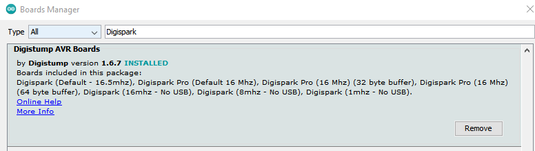
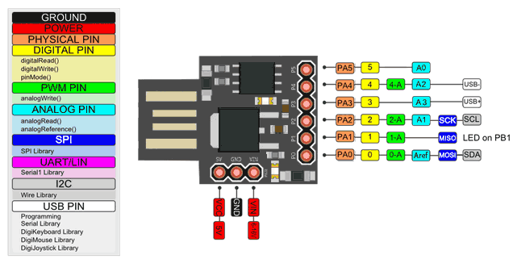

# Simple BadUSB

Simple BadUSB with Digispark ATTiny85

## How To

1. Install **Arduino IDE** and open it
2. Install Digispark Driver
    
    - **Windows 10** - Download and Install from this [Digistump.Drivers.v1.6.7.zip](Files/Digistump.Drivers.v1.6.7.zip) or [Official Link - Digistump.Drivers.zip](https://github.com/digistump/DigistumpArduino/releases)
    - **MacOS**
        - Fix `avr-g++: bad CPU type in executable Error compiling for board Digispark` problem

            ```Bash
            cd ~/Library/Arduino15/packages/arduino/tools/avr-gcc
            mv 4.8.1-arduino5 orig.4.8.1
            ln -s /Applications/Arduino.app/Contents/Java/hardware/tools/avr 4.8.1-arduino5
            ```


3. Goto `File` → `Preferences`
    
    Add this url `http://digistump.com/package_digistump_index.json` in **Additional Board Manager URLs**

4. Goto `Tools` → `Board` → `Boards Manager` then install **Digistump AVR Boards by Digistump**

   

5. Goto `Tools` → `Board` then select **DigiSpark (Default – 16.5 MHz)**
6. Let's play

## Architecture

- Digispark Rev3 USB

   
    From http://fitrox.lnwshop.com/article/84/tutorial-%E0%B8%81%E0%B8%B2%E0%B8%A3%E0%B9%83%E0%B8%8A%E0%B9%89%E0%B8%87%E0%B8%B2%E0%B8%99-digispark-kickstarter-attiny85
